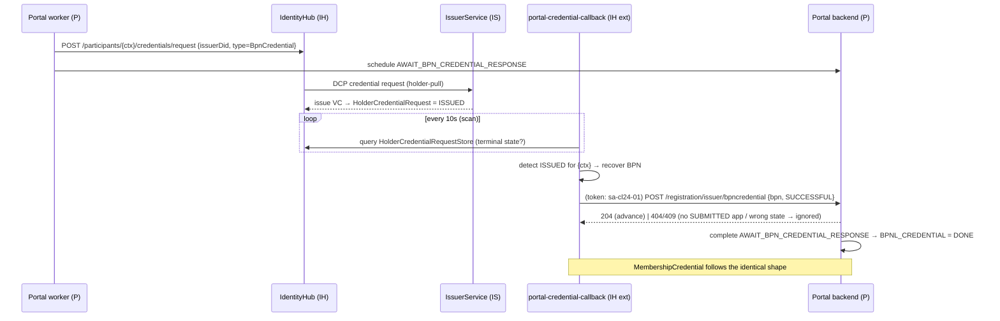

<!--
  Copyright (c) 2026 Contributors to the Eclipse Foundation
  SPDX-License-Identifier: CC-BY-4.0
  INTERNAL diagram — do NOT commit to main (per repo working rules). Local reference only.
-->

# BE-293 — IdentityHub wallet integration: end-to-end flowchart

The full Portal-onboarding-with-IdentityHub-wallet flow, from company invitation to an active participant.
Repo ownership: **P** = portal-backend (`:be293`), **IH** = identityhub (+ our observer extension),
**IS** = IssuerService, **U** = umbrella wiring/config, **B** = browser/operator (human).
Mermaid renders on GitHub / most IDEs.

## 1. Whole process (flowchart)

```mermaid
flowchart TD
    subgraph ONB["Registration & approval"]
        A0["Operator invites company<br/>POST /administration/invitation (P)"] --> A1["Worker creates idp1 shared realm<br/>+ invited user (P)"]
        A1 --> A2["Company logs in via idp1 broker<br/>completes form → SUBMIT (B)"]
        A2 --> A3{"Operator reviews"}
        A3 -->|approve| A4["REGISTRATION_VERIFICATION = DONE (P)"]
        A3 -->|decline| AX["application declined — stop"]
        A4 --> A5["Assign BPN (BPDM or manual)<br/>BUSINESS_PARTNER_NUMBER = DONE (P)"]
    end

    A5 --> W1["CREATE_IDENTITY_HUB_WALLET (P worker)"]
    subgraph WAL["Wallet creation (on the durable Postgres IdentityHub)"]
        W1 --> W2["POST identity-hub-admin.tx.test /participants<br/>create holder ParticipantContext = lowercased BPN (IH)"]
        W2 --> W3["POST /participants/{ctx}/state activate<br/>publish did:web document (IH)"]
        W3 --> W4["IDENTITY_WALLET = DONE (P)"]
    end

    W4 --> V1["VALIDATE_DID_DOCUMENT (P worker)"]
    V1 --> V2{"Resolve did:web via<br/>UNIVERSALRESOLVERADDRESS"}
    V2 -->|"in-cluster didweb-resolver shim (U):<br/>fetch IH did.json → resolver envelope → 200"| R1["REQUEST_*_CREDENTIAL"]
    V2 -->|"prod: real Universal Resolver over public HTTPS did:web"| R1
    V2 -.->|"only if DID unpublished (204/notFound) —<br/>worker create/activate race, open item"| VX["step FAILS<br/>(publish the DID, then re-run)"]

    subgraph CRED["Credential request + DCP issuance"]
        R1["REQUEST_BPN_CREDENTIAL + REQUEST_MEMBERSHIP_CREDENTIAL (P)<br/>POST IH /participants/{ctx}/credentials/request {issuerDid,type}"]
        R1 --> R2["schedule AWAIT_{BPN,MEMBERSHIP}_CREDENTIAL_RESPONSE (P)"]
        R1 --> D1["DCP: holder IH ⇄ IssuerService (IH/IS)"]
        D1 --> D2["HolderCredentialRequest → ISSUED<br/>VC stored in holder wallet (IH)"]
    end

    D2 --> C1["portal-credential-callback observer<br/>scans HolderCredentialRequestStore (IH ext)"]
    subgraph CB["Callback → checklist advance"]
        C1 --> C2["get centralidp token<br/>client sa-cl24-01 (has update_application_*_credential)"]
        C2 --> C3["POST /administration/registration/issuer/{bpn|membership}credential<br/>{bpn, status:SUCCESSFUL} (IH ext → P)"]
        C3 --> C4{"app SUBMITTED &<br/>AWAIT step present?"}
        C4 -->|yes| C5["complete AWAIT_*_CREDENTIAL_RESPONSE →<br/>BPNL_CREDENTIAL + MEMBERSHIP_CREDENTIAL = DONE (P)"]
        C4 -->|"no (seeded BPN / wrong state)"| C6["404/409 — safely ignored, dedup'd (IH ext)"]
    end

    C5 --> F1["CLEARING_HOUSE + SELF_DESCRIPTION_LP → APPLICATION_ACTIVATION (P)"]
    F1 --> F2["Participant ACTIVE — runs its connector<br/>presents Membership VP → BDRS → DCP data exchange"]

    classDef ext fill:#e8f0ff,stroke:#3b6;
    classDef warn fill:#fff3e0,stroke:#e69138;
    class C1,C2,C3 ext;
    class VX warn;
```

## 2. Issuance → callback core (sequence — the heart of BE-293)

## 3. Notes

- **Durability (D2):** the IdentityHub is Postgres-backed, so the wallet + credentials survive an IH pod restart
  (a Portal-onboarded participant cannot be "re-seeded"). Full Docker-restart durability also needs a persistent
  `umbrella-vault` (signing keys).
- **`VALIDATE_DID_DOCUMENT` (D11) — now resolved in-cluster:** a public Universal Resolver cannot reach a local
  `did:web:*.tx.test`, so this step used to be a demo DB bridge. It is now served by the in-cluster
  `didweb-resolver` shim (chart template `templates/didweb-resolver.yaml`) — the Portal resolves `did:web:*.tx.test` organically, no
  bridge. In production you drop the shim and point at a real Universal Resolver over public-HTTPS did:web (see D11).
  The only remaining dotted branch is when a participant's DID was never **published** (worker create/activate race);
  publish it and the step passes.
- **The observer needs no Portal change:** it posts the Portal's pre-existing issuer callback endpoint. See
  `BE-293-architecture-callback.md` (ADR) and `BE-293-cross-repo-changes-and-decisions.md` (D1–D11).
